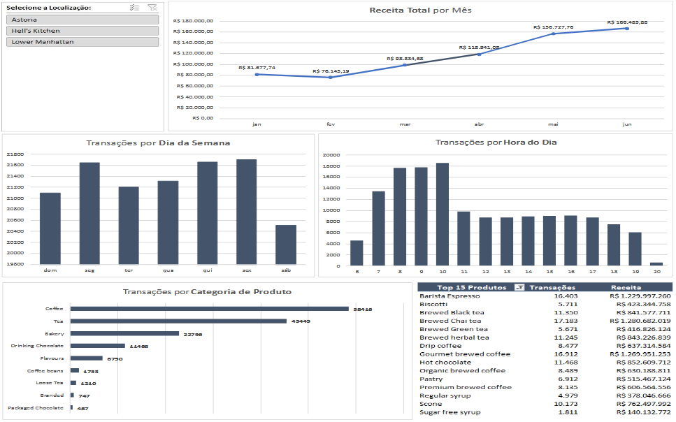

# Coffee Sales Analysis Dashboard (Excel)

## Visão Geral do Projeto

Com o objetivo de entender melhor o comportamento de compra dos clientes e otimizar as operações, foram analisados dados transacionais de janeiro a junho de 2023, transformando-os em um dashboard interativo no Excel.

O propósito foi criar uma ferramenta dinâmica de Business Intelligence que permita aos gestores da franquia identificar tendências, horários de pico, produtos com melhor desempenho e padrões de receita.

---

---

## Objetivos:

### 1. Preparação dos Dados
- Limpeza e estruturação dos dados brutos
- Criação de coluna calculada para Receita (Preço × Quantidade)
- Extração de:
  - Mês
  - Dia da Semana
  - Hora do Dia

### 2. Análise Exploratória
- Receita por Mês
- Transações por Dia da Semana
- Transações por Hora do Dia
- Transações por Categoria de Produto
- Top 15 Produtos por Transações e Receita

### 3. Desenvolvimento do Dashboard
- Análise de tendência de receita
- Análise de horários de pico
- Ranking de produtos
- Filtro por localização (Slicer)
- Resumo executivo

---

## Principais Insights:

- Crescimento de receita mês a mês
- Identificação dos horários mais movimentados
- Produtos mais vendidos
- Categorias mais lucrativas

---

## Ferramentas Utilizadas:

- Microsoft Excel
- Tabelas Dinâmicas
- Colunas Calculadas
- Segmentação de Dados
- Técnicas de Limpeza de Dados
- Design de Dashboard
---

## Impactos no Negócio:

- Otimização de equipe
- Foco em produtos estratégicos
- Identificação de estoque parado
- Decisões orientadas por dados

---
## Aprendizado:

Este projeto foi desenvolvido acompanhando a aula disponível neste vídeo: https://www.youtube.com/watch?v=OMFlZ6PI6Sk.
Ao longo do projeto, aprofundei meus conhecimentos em conceitos e técnicas importantes 
Recomendo fortemente para quem deseja evoluir seus estudos em Data Analytics e Business Intelligence.

Gabriel França da Silva  
Analista de Dados  
LinkedIn: https://www.linkedin.com/in/gabrielfranca123/
